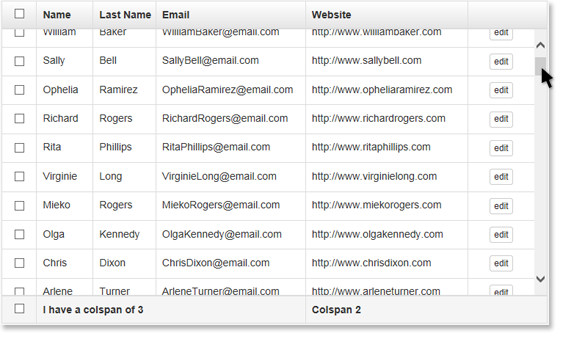

scrollTable
===========


Makes an html table scrollable with a fixed head and/or foot.  Based on [this work](http://salzerdesign.com/test/fixedTable.html).

[View Example](http://x2gboye.github.io/scrollTable/index.html).

Requirements
------------

jQuery (>= 1.7)

[jQuery Tablesorter](http://tablesorter.com/docs/) (optional for table sorting)

Usage
-----

```html
<!-- HTML -->

  <table id="table">
    
    <!-- thead is required -->
    <thead>
        <tr>
            <th>Name</th>
            <th>Last Name</th>
            <th>Email</th>
            <th>Website</th>
        </tr>
    </thead>
    
    <!-- tfoot is optional -->
    <tfoot>
    	  <tr>
    	      <!-- colspan is supported -->
            <td colspan="2">I have a colspan of 2</th>
            <td colspan="2">I have a colspan of 2/th>
        </tr>
    </tfoot>
    
    <!-- be sure to wrap your table body rows in <tbody> -->
    <tbody>
        <tr>
            <td>Rita</td>
            <td>Freeman</td>
            <td>RitaFreeman@email.com</td>
            <td>http://www.ritafreeman.com</td>
        </tr>
        <tr>...</tr>
        <tr>...</tr>
        <tr>...</tr>
    </tbody>
    
  </table>

```

```javascript
//JavaScript

$('#table').scrollTable(options);
```

**Note:** ```options``` is an optional javascript object with parameters explained below.

Options
-------

<table>
    <thead>
    	<tr>
    		<th>Option</th>
    		<th>Type</th>
    		<th>Default</th>
    		<th>Description</th>
    	</tr>
    </thead>
    <tbody>
    	<tr>
    		<td><strong>bordered</strong></td>
    		<td>bool</td>
    		<td>true</td>
    		<td>just adds and additional class '.{baseClass}-bordered' to main wrapping div you can use to add a border style (or whatever else you want).</td>
    	</tr>
    	<tr>
    		<td><strong>height</strong></td>
    		<td>int or string</td>
    		<td>300</td>
    		<td>The height of the table.  Supplying an int will be height in pixels. You can also supply a string for percentage based height: ex. '100%'.</td>
    	</tr>
    	<tr>
    		<td><strong>baseClass</strong></td>
    		<td>string</td>
    		<td>'ui-scrollTable'</td>
    		<td>Css class of main wrapping div that gets added to the DOM.</td>
    	</tr>
    	<tr>
    		<td><strong>wrapClass</strong></td>
    		<td>string</td>
    		<td>'ui-scrollTable-wrapper'</td>
    		<td>Css class of div that wraps the table and footer/header placeholder divs added to the DOM.</td>
    	</tr>
    	<tr>
    		<td><strong>headerClass</strong></td>
    		<td>string</td>
    		<td>'ui-scrollTable-header'</td>
    		<td>Css class of table heading placeholder div that gets added to the DOM.</td>
    	</tr>
    	<tr>
    		<td><strong>footerClass</strong></td>
    		<td>string</td>
    		<td>'ui-scrollTable-footer'</td>
    		<td>Css class of table foot placeholder div that gets added to the DOM, that is if your table has a tfoot.</td>
    	</tr>
    	<tr>
    		<td><strong>thClass</strong></td>
    		<td>string</td>
    		<td>'th-inner'</td>
    		<td>Css div that wraps the content of your thead th's.</td>
    	</tr>
    	<tr>
    		<td><strong>tfClass</strong></td>
    		<td>string</td>
    		<td>'tf-inner'</td>
    		<td>Css div that wraps the content of your tfoot td's (if you have them).</td>
    	</tr>
    </tbody>
</table>

```javascript
//example

$('#table').scrollTable({
  baseClass: 'ui-scrollTable',
  wrapClass: 'ui-scrollTable-wrapper',
  headerClass: 'ui-scrollTable-header',
  footerClass: 'ui-scrollTable-footer',
  thClass: 'th-inner',
  tfClass: 'tf-inner',
  height: 300,
  bordered: false
});
```

```html
<!-- example of DOM after scrollTable() is called -->

<div style="padding-top: 38px; padding-bottom: 38px; height: 300px;" class="ui-scrollTable ui-scrollTable-bordered">
    <div class="ui-scrollTable-header"></div>
    <div class="ui-scrollTable-footer"></div>
    <div class="ui-scrollTable-wrapper">
        <table id="table">
            <thead>
                <tr>
                    <th><div style="width: 221px; padding-left: 8px; line-height: 36px; top: 0px;" class="th-inner">First Name</div></th>
                    <th><div style="width: 246px; padding-left: 8px; line-height: 36px; top: 0px;" class="th-inner">Last Name</div></th>
                    <th><div style="width: 609px; padding-left: 8px; line-height: 36px; top: 0px;" class="th-inner">Email</div></th>
                    <th><div style="width: 639px; padding-left: 8px; line-height: 36px; top: 0px;" class="th-inner">Website</div></th>
                </tr>
            </thead>            
            <tfoot>
                <tr>
                    <td colspan="2"><div style="width: 467px; padding-left: 8px; line-height: 36px; bottom: 0px;" class="tf-inner">...</div></td>
                    <td colspan="2"><div style="width: 1248px; padding-left: 8px; line-height: 36px; bottom: 0px;" class="tf-inner">...</div></td>
                </tr>
            </tfoot>            
            <tbody>...</tbody>
        </table>
    </div><!--/ .ui-scrollTable-wrapper -->
</div><!--/ .ui-scrollTable -->
       


```

Methods
-------

- **resize**
Resizes the table header, footer cells to match their corresponding table body cells. This method automatically gets fired on $(window).resize(), but you may need to call it if your page layout changes thereby altering your table's width.

	```javascript
	$('#table').scrollTable('resize');
	```

- **destroy**
Removes all added elements from the DOM, returing your table to it's original state.

	```javascript
	$('#table').scrollTable('destroy');
	```
